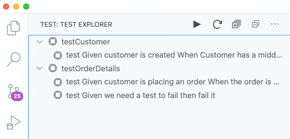
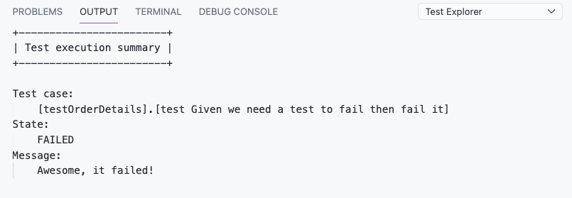

# tSQLt Test Explorer for Visual Studio Code


This extension enables you to run [tSQLt](https://github.com/tSQLt-org/tSQLt) unit tests from Visual Studio Code with the [Test Explorer UI](https://marketplace.visualstudio.com/items?itemName=hbenl.vscode-test-explorer).




## Getting started

- Install the extension.
- Configure Visual Studio Code to connect to a database where your source code with tSQLt extension is installed. See configuration section for more details. 
- In the sidebar, open the Test View and wait for the extension to discover your tests.
- When the tests are disovered you can run them using the play button. 

## Features

### Inspecting test result

The result of a test run can be inspected by clicking on any given test.  



## Requirements

To discover and running unit tests, the extension requires a running database with the tSQLt framework installed. 

There are numerous posts online that describes how to setup your database project with tSQLt as a testing framework, and how to include it in your workflow.

**Be aware!** Never install the testing framework on a production database.

## Extension Settings

This extension contributes to the following settings and are required for discovering and running tests.

```json
"tSQLtExplorer.tedious": {
    "description": "TediousJS configuration (http://tediousjs.github.io/tedious/)",
    "type": "object",
    "default": {
        "server": "localhost",
        "options": {
            "database": "tests",
            "encrypt": true,
            "trustServerCertificate": true
        },
        "authentication": {
            "type": "default",
            "options": {
                "userName": "",
                "password": ""
            }
        }
    }
}
```

## Known Issues

- Missing tSQLt framework discovery, will most likely thrown an error about SQL statements failing.
- SQL logins are the only tested authenctiation method.
- Cancellation of tests that are running is currently not supported.

This is an early release of the extension. Issues can be reported [here]()

## Release Notes

Users appreciate release notes as you update your extension.

### 0.1.0-alpha

Initial release of the extension to the public. 

